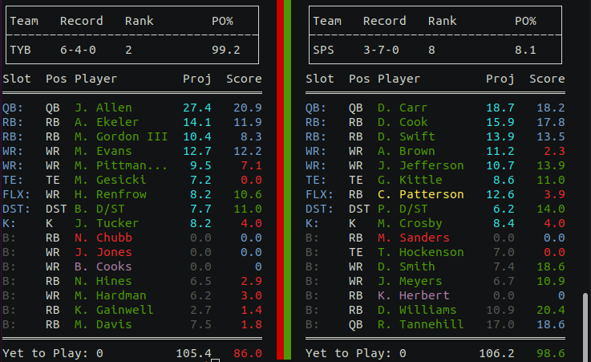

# Final Fantasy Roster Checker (Shell)



## Requiremets:
Python>=3.7:
<https://wiki.python.org/moin/BeginnersGuide/Download>

Installation:
```
git clone https://github.com/oprince-tech/FF.git
cd FF
pip3 install .
```
Installing into a virtual environment (alternate):
```
git clone https://github.com/oprince-tech/FF.git
cd FF
python3 -m venv venv
source venv/bin/active
pip3 install .
```

## Usage:
```
FF [-p] [-w WEEK] [-l LEAGUE_ID] [-t TEAM_ID] [-s SEASON] [-c] [--SWID SWID] [--espn_s2 ESPN_S2] [-m] [-d] [-h]
```

### Notes:
|Option    |Description|
|----------|------------------------------|
|-p        |Pull from your ESPN Fantasy League|
|-l        |Your ESPN League ID|
|-t        |The Team ID to view|
|-s        |Season's year (e.g. 2021)|
|-w        |Week|
|--SWID    |Your SWID (cookies)|
|--espn_s2 |Your espn_s2 (cookie)|
|-m        |View team's matchup|
|-d        |Reads 'cookies-dev.json' (gitignored)|
|-h        |Help|

## Accessing your cookies:
### Chrome

### Firefox

Paste the SWID and espn_s2 values into the cookies.json file or after the --SWID / --espn_s2 flag.
